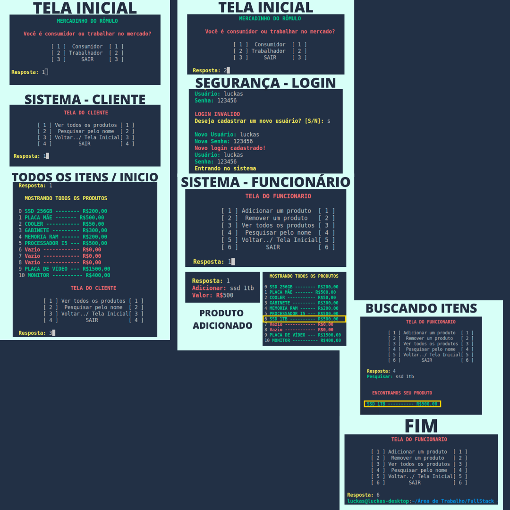

<h1 align="center"> Sistema Logístico com Tabela Hash </h1>

<p align="center">O objetivo principal é conseguir simular um sistema logístico simples utilizando a Tabela Hash como a estrutura de dados principal.</p>

<p align="center"> 
  <a href="https://www.python.org/">
        
  </a>
</p>

<p align="center">
 <a href="#objetivo">Objetivo</a> •
 <a href="#roadmap">Roadmap</a> • 
 <a href="#tecnologias">Tecnologias</a> • 
 <a href="#contribuicao">Contribuição</a> • 
 <a href="#licenc-a">Licença</a> • 
 <a href="#autor">Autor</a>
</p>

<h4 align="center"> 
	🚧  Sistema Logístico com Tabela Hash 🚀 Em construção...  🚧
</h4>

#

### Features

- [x] Cadastro de usuário
- [x] Cadastro de cliente
- [x] Cadastro de produtos
- [x] Pesquisar de produtos
- [x] ver todos os produtos
- [ ] Remoção de produtos
- [ ] Compra de produtos

### Demonstrações
<h1 align="center">
  
</h1>

### Pré-requisitos

Antes de começar, você vai precisar ter instalado em sua máquina as seguintes ferramentas:
[Git](https://git-scm.com), [Python](https://www.python.org). 
Além disto é bom ter um editor para trabalhar com o código como [VSCode](https://code.visualstudio.com/)

### 🎲 Rodando o Sistema Logístico

```bash
# Clone este repositório
$ git clone <https://github.com/Luckas-Ferreira/Projeto-Criando-um-mercado-ED.git>

# Acesse a pasta do projeto no terminal/cmd
$ cd Projeto-Criando-um-mercado-ED

# Abra o Visual Code
$ code .

# Execulte o arquivo
$ SistemaPrincipal.py
```

### 🛠 Tecnologia

A seguinte ferramenta foi usada na construção do projeto:

- [Python](https://www.python.org)

### Autor
---

<a href="https://github.com/Luckas-Ferreira">
 
 <br />
 <sub><b>Luckas Ferreira</b></sub></a> <a href="https://github.com/Luckas-Ferreira" title="Sistema Logístico">🚀</a>

[](https://twitter.com/tgmarinho)
[](https://www.linkedin.com/in/tgmarinho/) 
[](mailto:tgmarinho@gmail.com)
